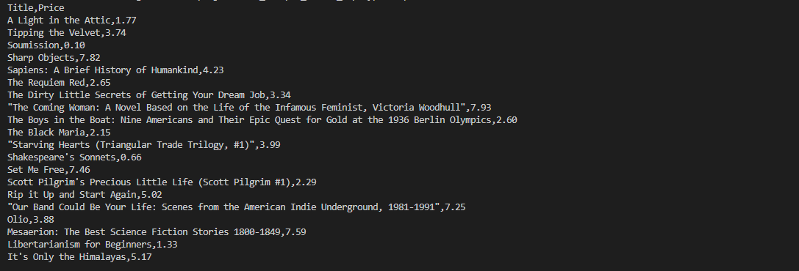

# Web Scraper Docker Project

This project is a simple web scraper that has been built with the use of Python, that essentially extracts book titles and prices from [Books to Scrape](http://books.toscrape.com/). The application is containerized using Docker and managed with Docker Compose for ease of deployment and scalability.

## Features

- Scrapes book titles and prices from an online bookstore.
- Uses `requests` and `BeautifulSoup` for web scraping.
- Containerized with Docker for consistent environments.
- Managed with Docker Compose for simplified commands.
- Outputs data to the console and saves it to a CSV file.

## Prerequisites

- [Docker](https://www.docker.com/get-started) installed on your machine.
- [Docker Compose](https://docs.docker.com/compose/install/) installed (usually included with Docker Desktop).

## Project Structure

web_scraper_docker_exp/  
├── Dockerfile        
├── docker-compose.yml       
├── requirements.txt  
├── scrape_books.py           
├── README.md                
├── LICENSE              
├── .gitignore                
└── output/                   
    └── books.csv             


## Setup and Usage

### **1. Clone the Repository**

```bash
git clone https://github.com/yourusername/web_scraper_docker_exp.git
cd web_scraper_docker_exp
```

### **2. Create the Output Directory**
Ensure that the output directory exists:
```bash
mkdir output
```

### **3. Build and Run the Docker Container**
Use Docker Compose to build the image and run the container:
```bash
docker-compose up --build
```

Note: The first time you run this command, it will build the Docker image. Subsequent runs can use docker-compose up without the --build flag unless you've made changes to the Dockerfile or application code.

### **4. View the Output**
After the script completes, the scraped data will be saved to output/books.csv.

To view the contents:
On Windows Command Prompt:
```bash
type output\books.csv
```

On Windows PowerShell or Unix-based Systems:

```bash
cat output/books.csv
```

### **5. Stop the Docker Container**
To stop the running container:
```bash
docker-compose down
```

## Commands Reference
Build and Run:
```bash
docker-compose up --build
```

Run Without Building:
```bash
docker-compose up
```

Stop Containers:
```bash
docker-compose down
```

## Sample Output



## License
This project is licensed under the MIT License - see the LICENSE file for details.

## Acknowledgments
'Books' to Scrape' for providing a practice website for web scraping.  
Docker for containerization tools.  
BeautifulSoup and Requests for making web scraping in Python easy.  